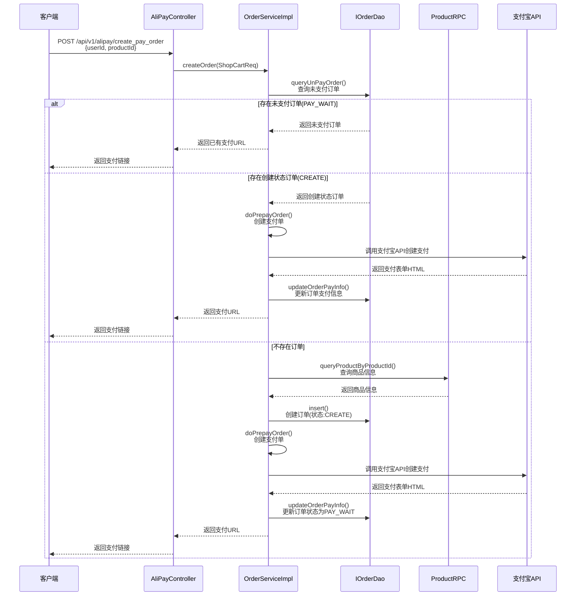
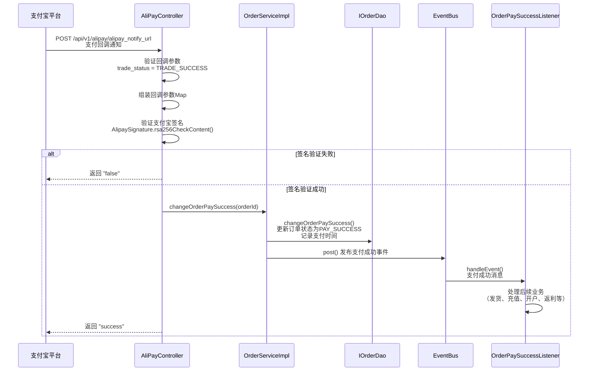
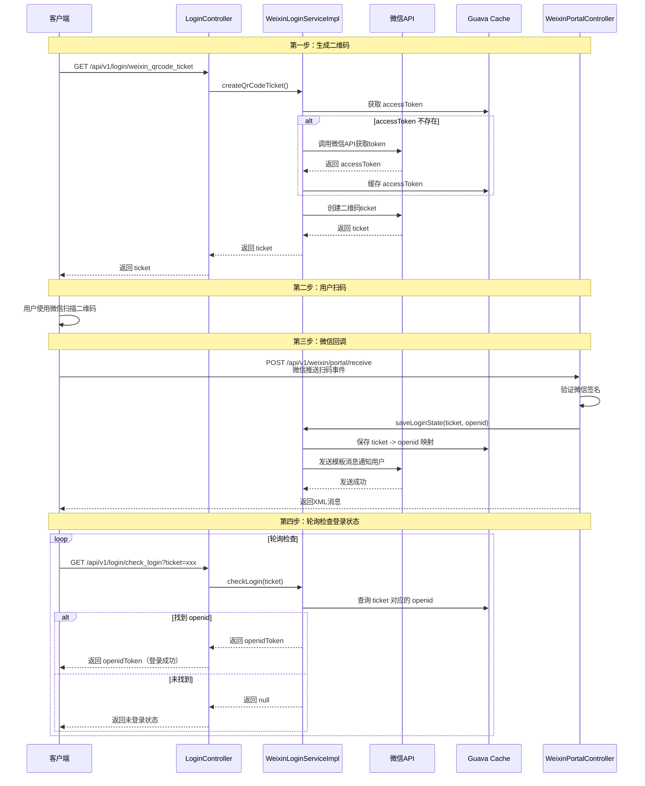
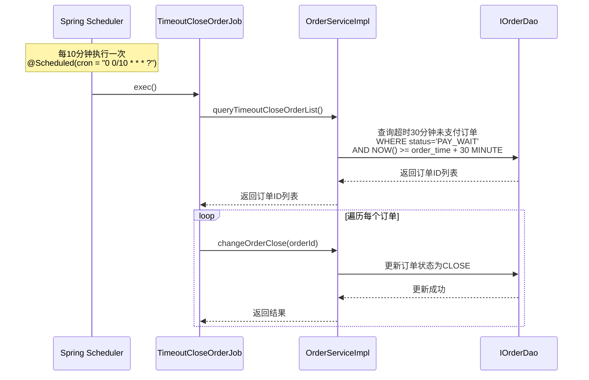
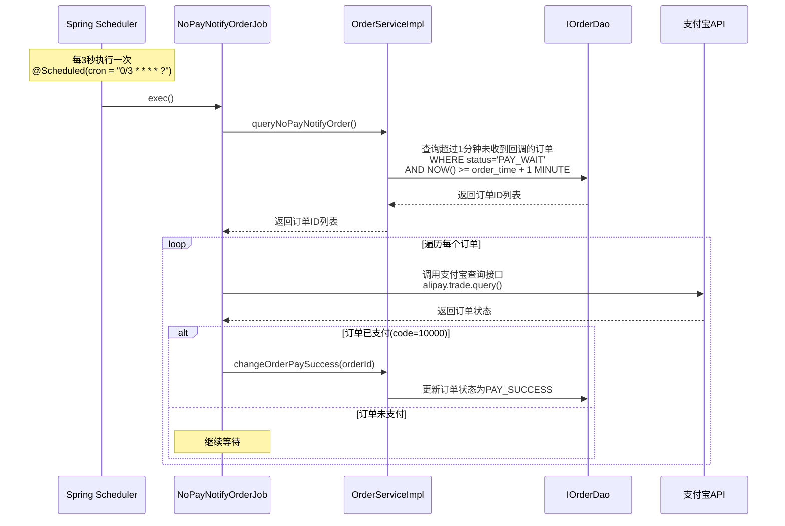
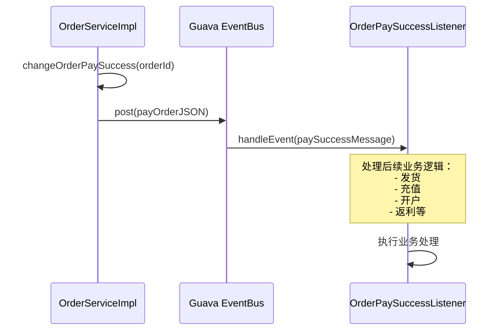
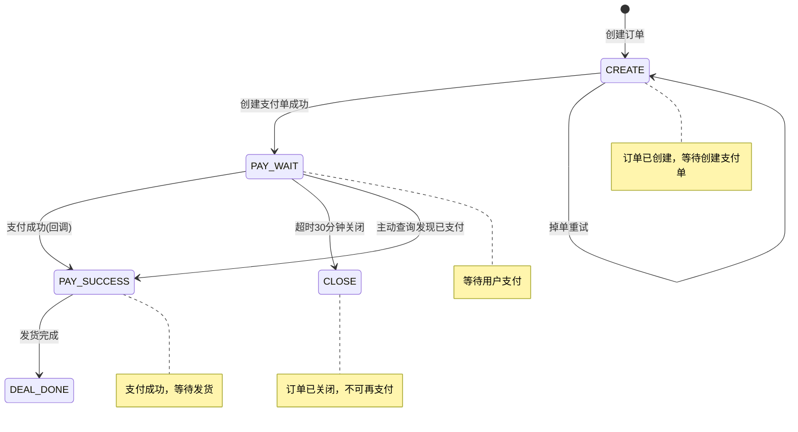

# 核心业务流程时序图

## 一、支付下单流程

### 流程图

### 流程说明

1. **客户端请求**: 发送下单请求，包含用户ID和商品ID
2. **订单查询**: 检查是否存在未支付订单
   - 如果存在 `PAY_WAIT` 状态订单，直接返回已有支付链接
   - 如果存在 `CREATE` 状态订单，创建支付单
   - 如果不存在，创建新订单
3. **商品查询**: 通过 ProductRPC 获取商品信息
4. **订单创建**: 在数据库中插入订单记录（状态: `CREATE`）
5. **支付单创建**: 调用支付宝 API 生成支付表单
6. **订单更新**: 更新订单状态为 `PAY_WAIT`，保存支付链接
7. **返回结果**: 返回支付表单 HTML，客户端可直接跳转支付

---

## 二、支付回调流程

### 流程图

### 流程说明

1. **支付回调**: 用户完成支付后，支付宝异步回调系统
2. **参数验证**: 验证回调参数中的交易状态
3. **签名验证**: 使用支付宝公钥验证回调签名，防止伪造
4. **订单更新**: 
   - 更新订单状态为 `PAY_SUCCESS`
   - 记录支付时间
5. **事件发布**: 通过 EventBus 发布支付成功事件
6. **后续处理**: 监听器处理后续业务（发货、充值等）
7. **响应支付宝**: 返回 "success" 表示处理成功

---

## 三、微信扫码登录流程

### 流程图

### 流程说明

1. **生成二维码**: 
   - 客户端请求生成登录二维码
   - 系统调用微信 API 获取 accessToken（带缓存）
   - 调用微信 API 创建二维码，获取 ticket
   - 返回 ticket 给客户端

2. **用户扫码**: 用户使用微信扫描二维码

3. **微信回调**: 
   - 微信推送扫码事件到系统
   - 系统验证签名
   - 保存 ticket 与 openid 的映射关系（存入缓存）
   - 发送模板消息通知用户登录成功

4. **轮询检查**: 
   - 客户端轮询检查登录状态
   - 系统从缓存中查找 ticket 对应的 openid
   - 如果找到，返回 openidToken，登录成功

---

## 四、定时任务流程

### 4.1 超时关单任务

**功能**: 每10分钟检查一次，关闭超过30分钟未支付的订单

---

### 4.2 支付回调检测任务

**功能**: 每3秒检查一次，主动查询可能未收到回调的支付订单，确保订单状态同步

---

## 五、事件驱动流程

### 支付成功事件处理

**功能**: 支付成功后，通过事件总线异步处理后续业务，解耦业务逻辑

---

## 六、订单状态流转

### 状态机图

### 状态说明

- **CREATE**: 订单创建完成，等待创建支付单
- **PAY_WAIT**: 等待支付，已生成支付链接
- **PAY_SUCCESS**: 支付成功，等待发货
- **DEAL_DONE**: 交易完成，已发货
- **CLOSE**: 超时关闭，订单失效

